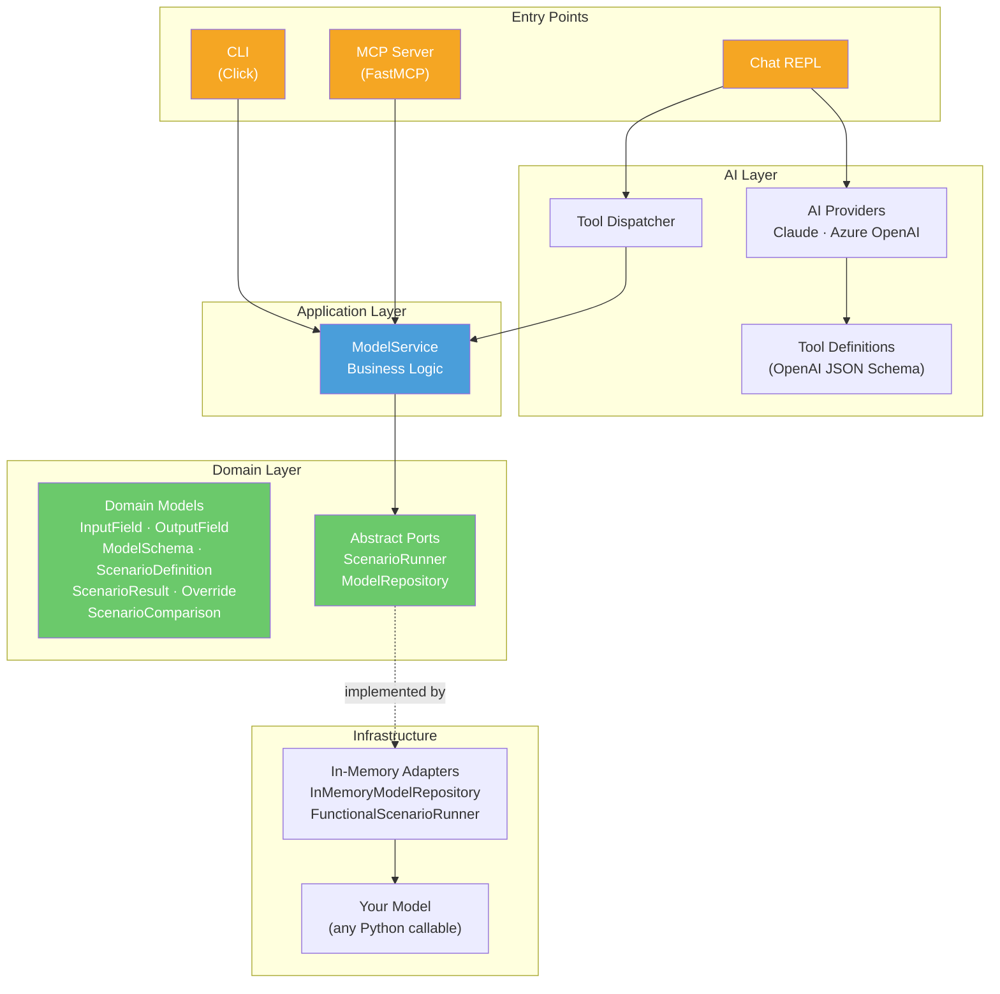

<div align="center">
  

# Explicator

**Provider-agnostic natural language AI interface for scenario-driven analytical modelling**

</div>

`Explicator` bridges the gap between complex analytical models and the people who need to understand them. Ask a question in plain English, it identifies the right scenarios to run, executes them against your model, and returns a clear explanation of what the results mean. No model expertise required.

Provider-agnostic by design, Explicator works with Claude, Azure OpenAI, Copilot, or any LLM your organisation uses.

---

## Architecture

Explicator follows a ports & adapters (hexagonal) architecture. The domain and application layers contain no framework code — adapters translate between external interfaces and the core `ModelService`.



---

## Project Structure

```
explicator/
├── src/explicator/
│   ├── domain/              # Core data structures and abstract ports
│   │   ├── models.py        # ScenarioDefinition, ScenarioResult, ModelSchema, etc.
│   │   └── ports.py         # ScenarioRunner, ModelRepository (abstract interfaces)
│   ├── application/
│   │   └── service.py       # ModelService — single entry point for all business logic
│   ├── adapters/
│   │   ├── cli/             # Click-based CLI adapter
│   │   ├── mcp_server/      # FastMCP server adapter (for Claude Desktop / MCP clients)
│   │   └── data/            # Infrastructure adapters (in-memory implementations)
│   ├── ai/
│   │   ├── tools/           # Tool definitions in OpenAI function-calling JSON schema format
│   │   ├── providers/       # Provider adapters: Claude, Azure OpenAI (+ abstract base)
│   │   └── dispatcher.py    # Shared tool dispatcher (provider-agnostic)
│   └── config.py            # Configuration via environment variables
├── examples/
│   └── demo_model/          # Bond portfolio risk model — shows how to wire Explicator
├── docs/
│   └── model_schema.md      # Rich domain description for AI context
└── tests/
    ├── unit/
    └── integration/
```

`explicator` is the library — install it as a dependency and build your model on top of it, just as you would with `fastapi` or `click`. Your model code lives in your own project; `explicator` provides the service layer, AI interface, CLI, and MCP server.

---

## Quick Start

### 1. Install

```bash
uv sync --extra claude --extra dev
```

For Azure OpenAI instead:

```bash
uv sync --extra azure --extra dev
```

Or with pip:

```bash
pip install -e ".[claude,dev]"
```

### 2. Configure

```bash
cp .env.example .env
# Edit .env and set your API key and provider
```

### 3. Run the demo CLI

```bash
# List scenarios
explicator --service examples.demo_model.model:build_service scenarios

# Run a scenario
explicator --service examples.demo_model.model:build_service run base_case

# Run with an override
explicator --service examples.demo_model.model:build_service run base_case -o credit_spread_ig=2.5

# Compare two scenarios
explicator --service examples.demo_model.model:build_service compare base_case credit_stress

# Chat with an AI about the model
explicator --service examples.demo_model.model:build_service chat
```

Set `EXPLICATOR_SERVICE` in your environment to avoid repeating the flag:

```bash
export EXPLICATOR_SERVICE=examples.demo_model.model:build_service
explicator run base_case
explicator chat "what happens to duration in the stagflation scenario?"
```

### 4. Start the MCP Server

**With the demo model:**

```bash
uv run mcp dev examples/demo_model/run_mcp.py
```

**Via the entry point:**

```bash
explicator-mcp examples.demo_model.model:build_service
# or
python -m explicator.adapters.mcp_server examples.demo_model.model:build_service
```

### 5. Connect Claude Desktop

Copy `claude_desktop_config.json.example` into your Claude Desktop config:

```json
{
  "mcpServers": {
    "explicator": {
      "command": "uv",
      "args": [
        "run",
        "python",
        "-m",
        "explicator.adapters.mcp_server",
        "myapp.model:build_service"
      ],
      "env": {
        "ANTHROPIC_API_KEY": "your-api-key-here"
      }
    }
  }
}
```

Then ask Claude things like:

- _"Run the credit stress scenario and tell me what happened to portfolio duration."_
- _"Override the credit spread input to 250bps and rerun the base case."_
- _"What are the key assumptions in this model?"_
- _"Compare the stagflation and rates_shock_up scenarios."_

---

## Connecting Your Own Model

`explicator` is a library — your model code lives in your own project. A typical layout:

```
my-risk-app/
├── pyproject.toml           # dependencies = ["explicator[claude]"]
├── .env                     # ANTHROPIC_API_KEY=...
└── src/myapp/
    ├── model.py             # schema, scenarios, model_fn, build_service()
    └── run_mcp.py           # calls explicator.run_mcp(service)
```

```python
# src/myapp/model.py
import explicator

service = explicator.create(
    model_fn=my_model_fn,
    base_inputs=MY_BASE_INPUTS,
    schema=MY_SCHEMA,
    scenarios=MY_SCENARIOS,
)
```

```python
# src/myapp/run_mcp.py
import explicator
from myapp.model import service

if __name__ == "__main__":
    explicator.run_mcp(service)
```

```bash
# CLI — point --service at any module:attribute that returns a ModelService
explicator --service myapp.model:service scenarios
explicator --service myapp.model:service run base_case
explicator --service myapp.model:service chat
```

Explicator uses the ports & adapters pattern. The quickest way to wire up any Python model function:

```python
import explicator

def my_model(inputs: dict) -> dict:
    # Your model logic here
    return {"metric_a": ..., "metric_b": ...}

service = explicator.create(
    model_fn=my_model,
    base_inputs=MY_BASE_INPUTS,
    schema=MY_SCHEMA,
    scenarios=MY_SCENARIOS,
)

if __name__ == "__main__":
    explicator.run_mcp(service)
```

For custom storage or execution backends, implement `ScenarioRunner` and `ModelRepository` directly and pass them to `ModelService`:

```python
from explicator import ModelService
from explicator.domain.ports import ScenarioRunner, ModelRepository

class MyRunner(ScenarioRunner): ...
class MyRepository(ModelRepository): ...

service = ModelService(runner=MyRunner(), repository=MyRepository())
```

See `examples/demo_model/model.py` for a complete worked example.

---

## AI Provider Configuration

Set `AI_PROVIDER` in your environment:

| Value              | Provider         | Required env vars                                                          |
| ------------------ | ---------------- | -------------------------------------------------------------------------- |
| `claude` (default) | Anthropic Claude | `ANTHROPIC_API_KEY`                                                        |
| `azure_openai`     | Azure OpenAI     | `AZURE_OPENAI_API_KEY`, `AZURE_OPENAI_ENDPOINT`, `AZURE_OPENAI_DEPLOYMENT` |

Tool definitions live in `src/explicator/ai/tools/definitions.py` in OpenAI function-calling
JSON schema format — a single source of truth consumed by all providers.

---

## Running Tests

```bash
uv run pytest
```

---

## Layer Responsibilities

| Layer | Location | Role |
|-------|----------|------|
| **Domain** | `domain/` | Pure Python dataclasses and abstract interfaces — no framework code |
| **Application** | `application/service.py` | Business logic via `ModelService` — no framework code, tested directly |
| **Adapters** | `adapters/` | Thin translation layers — CLI and MCP server both call `ModelService` |
| **AI** | `ai/` | Provider adapters, tool definitions, and dispatcher — no business logic |

The MCP server and CLI are parallel entry points into the same application layer. They share no code with each other except through `ModelService`.
